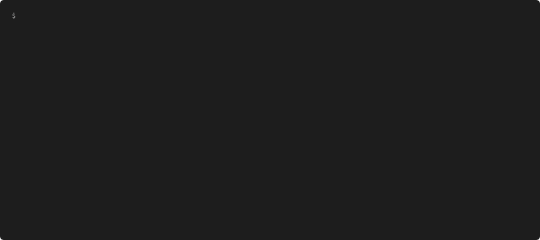

# BadBishopBot
Bot.py contains the code for the bot. The diagram sacn is done by Brdtofen, the only changes done to their code is cleaning up the output and saving the FEN to a .txt file. If you want to scan diagrams locally, please visit Brdtofen and download their repository.

# Brdtofen

Uses a convolutional neural network to recognize the positions of pieces
on a chessboard image.

If you have an image of a chessboard in `chessboard.png`


Run the program like this

`./recognize.py chessboard.png`

To get the chessboard position in [FEN](https://en.wikipedia.org/wiki/Forsyth%E2%80%93Edwards_Notation) notation

`3rkb1r/1pp2ppp/2n1q1n1/p3Pb2/2Pp4/PN3NB1/1P1QPPPP/3RKB1R`

## Demo

Demo ran on a Ryzen 3700X (8 cores) with 1205 images stored on an SSD.
Prediction rate is average time taken to process the batch.
Each image is approximately 800x800 square pixels in dimension -- about 0.68 MB each.
The neural network trained for the demo is provided in the file 'nndemo.tar.xz' in
the 'demo' directory. This tar should be expanded from the root of the repo.
Any model living in the folder 'model.tf' under 'nn' will probably be borked by the expansion.

## Sample results

Chess puzzle from a book:


Predicted: [2r2k1r/6bp/p3q3/4pp1Q/1p1n2P1/N7/PPP3BP/2KR1R2](https://lichess.org/analysis/standard/2r2k1r/6bp/p3q3/4pp1Q/1p1n2P1/N7/PPP3BP/2KR1R2) (99.633% confidence)

Lichess analysis board diagram with arrows:


Predicted: [5r1k/2q1r1pp/2p4n/2P2B2/pPQ1pR2/P5P1/4R2P/7K](https://lichess.org/analysis/standard/5r1k/2q1r1pp/2p4n/2P2B2/pPQ1pR2/P5P1/4R2P/7K) (99.997% confidence)

## Getting started

You'll need python 3 and [Tensorflow 2](https://www.tensorflow.org/)

Set up your virtualenv and install python dependencies
```
virtualenv venv
source venv/bin/activate
pip3 install -r requirements.txt
```

You'll need a neural network model to use `./recognize.py`

To use a pre-trained model, download [nn.zip](https://github.com/linrock/chessboard-recognizer/releases/download/v0.5/nn.zip) and unzip in the project root folder.

To train your own model, you'll first need lots of images of chessboards

* For the images used in the pre-trained model, download [training-images.zip](https://github.com/linrock/chessboard-recognizer/releases/download/v0.4/training-images.zip) and unzip in the project root directory
* Or generate your own training images with this script:
  * `./generate_chessboards.py` downloads a bunch of chessboard images with randomly-placed pieces
  
Then run this script to convert the chessboard images into 32x32 PNGs of each square of the board
  * `./generate_tiles.py` converts these downloaded chessboard images into 32x32 PNGs used for training

Once you have tiles images ready for the training inputs, run this:
  * `./train.py` creates a new neural network model

Once you have a neural network model ready, run `./recognize.py` with a path to a chessboard image:

`./recognize.py ~/Desktop/chessboard.png`


## Debugging

To verify that the generated 32x32 PNG tile images match the source chessboard image, use this script:
  * `./view_images.py` for a convenient way to manually verify the generated images

Then open `images.html` to view the chessboard and tile images with their corresponding pieces.

To debug the predicted outputs, open `debug.html` after running `./recognize.py` to view the actual/predicted boards


Each prediction shows the actual board, the predicted board, the prediction confidence for each square, and a link to a board editor so you can edit the actual FEN in case the predicted FEN is wrong.

Incorrect or low-confidence predictions are a great source of training chessboard images.

For a convenient way to add a training image, use this script:
  * `./save_chessboard.py chessboard.png <subdirectory> <actual fen>`

Then you can generate more tiles and re-train the model for more-accurate future predictions.


## Acknowledgements

* Original inspiration from [tensorflow_chessbot](https://github.com/Elucidation/tensorflow_chessbot) by [Elucidation](https://github.com/Elucidation)
* Neural network architecture from https://www.tensorflow.org/tutorials/images/cnn
